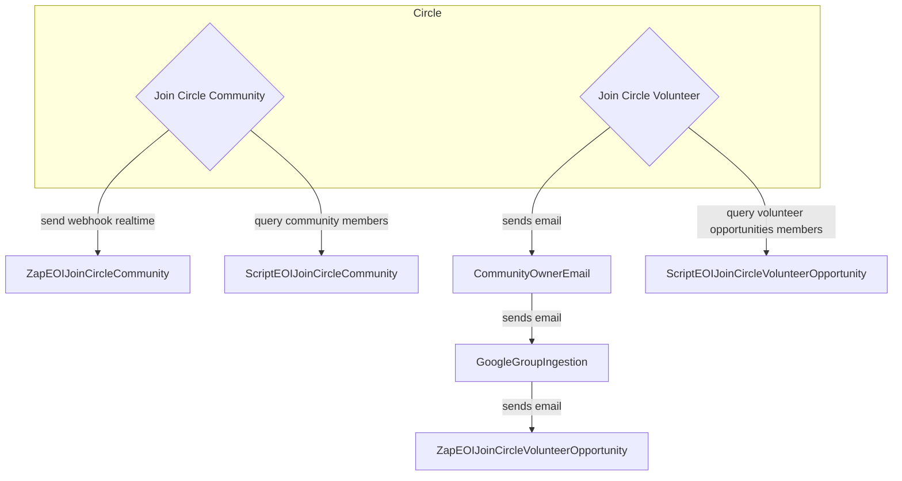

```mermaid
graph TD;

%% CIRCLE SIDE
%% Verified email, user initiates action
subgraph Circle
joinCircleCommunity{Join Circle Community}
joinCircleVolunteer{Join Circle Volunteer}
end

joinCircleCommunity-->|send webhook realtime|ZapEOIJoinCircleCommunity

joinCircleCommunity-->|query community members|ScriptEOIJoinCircleCommunity

joinCircleVolunteer-->|sends email|CommunityOwnerEmail
CommunityOwnerEmail-->|sends email|GoogleGroupIngestion
GoogleGroupIngestion-->|sends email|ZapEOIJoinCircleVolunteerOpportunity

joinCircleVolunteer-->|query volunteer opportunities members|ScriptEOIJoinCircleVolunteerOpportunity


```
