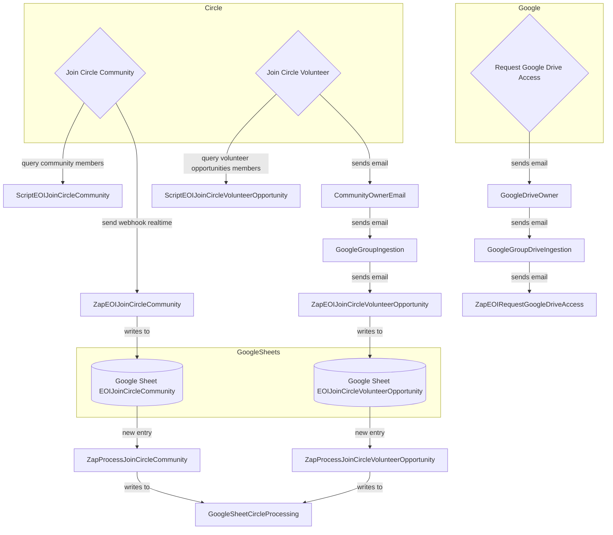

```mermaid
graph TD;

%% CIRCLE SIDE
%% Verified email, user initiates action
subgraph Circle
joinCircleCommunity{Join Circle Community}
joinCircleVolunteer{Join Circle Volunteer}
end

joinCircleCommunity-->|send webhook realtime|ZapEOIJoinCircleCommunity

joinCircleCommunity-->|query community members|ScriptEOIJoinCircleCommunity

joinCircleVolunteer-->|sends email|CommunityOwnerEmail
CommunityOwnerEmail-->|sends email|GoogleGroupIngestion
GoogleGroupIngestion-->|sends email|ZapEOIJoinCircleVolunteerOpportunity

joinCircleVolunteer-->|query volunteer opportunities members|ScriptEOIJoinCircleVolunteerOpportunity


ZapEOIJoinCircleCommunity-->|writes to|GoogleSheetEOIJoinCircleCommunity

ZapEOIJoinCircleVolunteerOpportunity-->|writes to|GoogleSheetEOIJoinCircleVolunteerOpportunity

subgraph GoogleSheets
GoogleSheetEOIJoinCircleCommunity[(Google Sheet EOIJoinCircleCommunity)]
GoogleSheetEOIJoinCircleVolunteerOpportunity[(Google Sheet EOIJoinCircleVolunteerOpportunity)]
end

GoogleSheetEOIJoinCircleCommunity-->|new entry|ZapProcessJoinCircleCommunity
GoogleSheetEOIJoinCircleVolunteerOpportunity-->|new entry|ZapProcessJoinCircleVolunteerOpportunity

ZapProcessJoinCircleCommunity-->|writes to|GoogleSheetCircleProcessing
ZapProcessJoinCircleVolunteerOpportunity-->|writes to|GoogleSheetCircleProcessing

%% Google side
subgraph Google
requestGoogleDriveAccess{Request Google Drive Access}
end

requestGoogleDriveAccess-->|sends email|GoogleDriveOwner
GoogleDriveOwner-->|sends email|GoogleGroupDriveIngestion
GoogleGroupDriveIngestion-->|sends email|ZapEOIRequestGoogleDriveAccess


```
