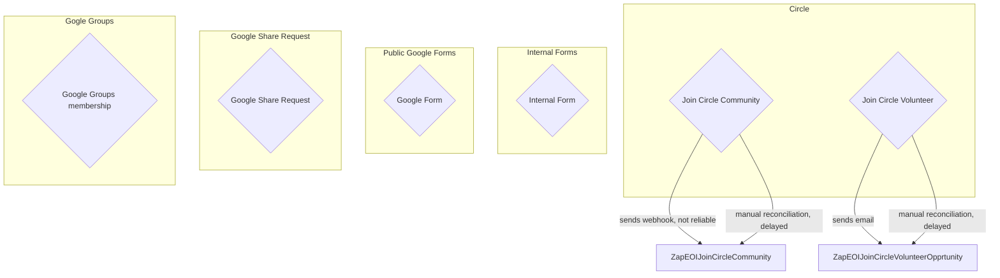

```mermaid
graph TD;

%% CIRCLE SIDE
%% Verified email, user initiates action
subgraph Circle
joinCircleCommunity{Join Circle Community}
joinCircleVolunteer{Join Circle Volunteer}
end

joinCircleCommunity-->|sends webhook, not reliable|ZapEOIJoinCircleCommunity
joinCircleCommunity-->|manual reconciliation, delayed|ZapEOIJoinCircleCommunity

joinCircleVolunteer-->|sends email|ZapEOIJoinCircleVolunteerOpprtunity
joinCircleVolunteer-->|manual reconciliation, delayed|ZapEOIJoinCircleVolunteerOpprtunity

%% Internal Forms
%% Internal form, assumes EOI given
subgraph Internal Forms
FillOutInternalForm{Internal Form}
end


%% Public Google Forms
%% Rerquire valid google account email, so that ensures sharing will work
subgraph Public Google Forms
FillOutGoogleForm{Google Form}
end

%% Google Share Request
%% Rerquire valid google account email, so that ensures sharing will work
%% This could be automated to add tem, or reply with signup links
subgraph Google Share Request
GoogleShareRequest{Google Share Request}
end

%% Google Groups
%% Do we allow arbitrary signup? no... existing users however.
subgraph Gogle Groups
GoogleGroups{Google Groups membership}
end

```
