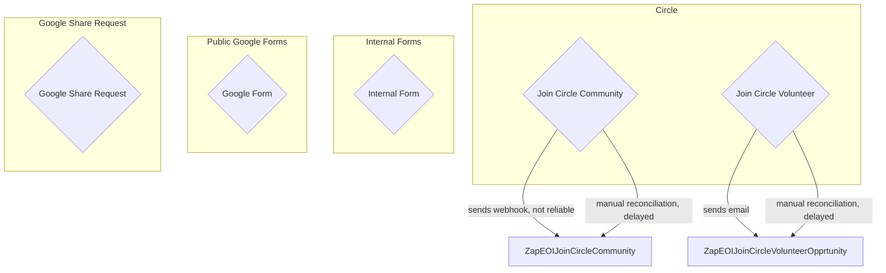

```mermaid
graph TD;

%% CIRCLE SIDE
%% Verified email, user initiates action
subgraph Circle
joinCircleCommunity{Join Circle Community}
joinCircleVolunteer{Join Circle Volunteer}
end

joinCircleCommunity-->|sends webhook, not reliable|ZapEOIJoinCircleCommunity
joinCircleCommunity-->|manual reconciliation, delayed|ZapEOIJoinCircleCommunity
%% POST api/v2.0/Communities/GetCommunityMembers

joinCircleVolunteer-->|sends email|ZapEOIJoinCircleVolunteerOpprtunity
joinCircleVolunteer-->|manual reconciliation, delayed|ZapEOIJoinCircleVolunteerOpprtunity
%% GET api/v2.0/Volunteer/GetVolunteerList?volunteerOpportunityKey={volunteerOpportunityKey}


%% Internal Forms
%% Internal form, assumes EOI given
subgraph Internal Forms
FillOutInternalForm{Internal Form}
end


%% Public Google Forms
%% Rerquire valid google account email, so that ensures sharing will work
subgraph Public Google Forms
FillOutGoogleForm{Google Form}
end

%% Google Share Request
%% Rerquire valid google account email, so that ensures sharing will work
%% This could be automated to add tem, or reply with signup links
subgraph Google Share Request
GoogleShareRequest{Google Share Request}
end


```
