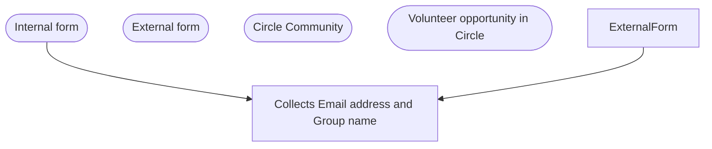

```mermaid
graph TD;


internalForm([Internal form])

externalForm([External form])
%% requires email validation, e.g. Google forms "Collect email addresses Respondents will be required to sign in to Google"

joinCommunity([Circle Community])
joinVolunteer([Volunteer opportunity in Circle])

internalForm --> collectEmailAndGroup[Collects Email address and Group name]
ExternalForm --> collectEmailAndGroup[Collects Email address and Group name]


%% internalForm -->|collects|Email and community name[Email and community name]
%% externalForm -->|collects|Email and community name[Email and community name]
%% joinCommunity -->|Reports|ContactKey and CommunityKey[ContactKey and CommunityKey]
%% joinVolunteer -->|Reports|ContactKey and CommunityKey[ContactKey and CommunityKey]

```
