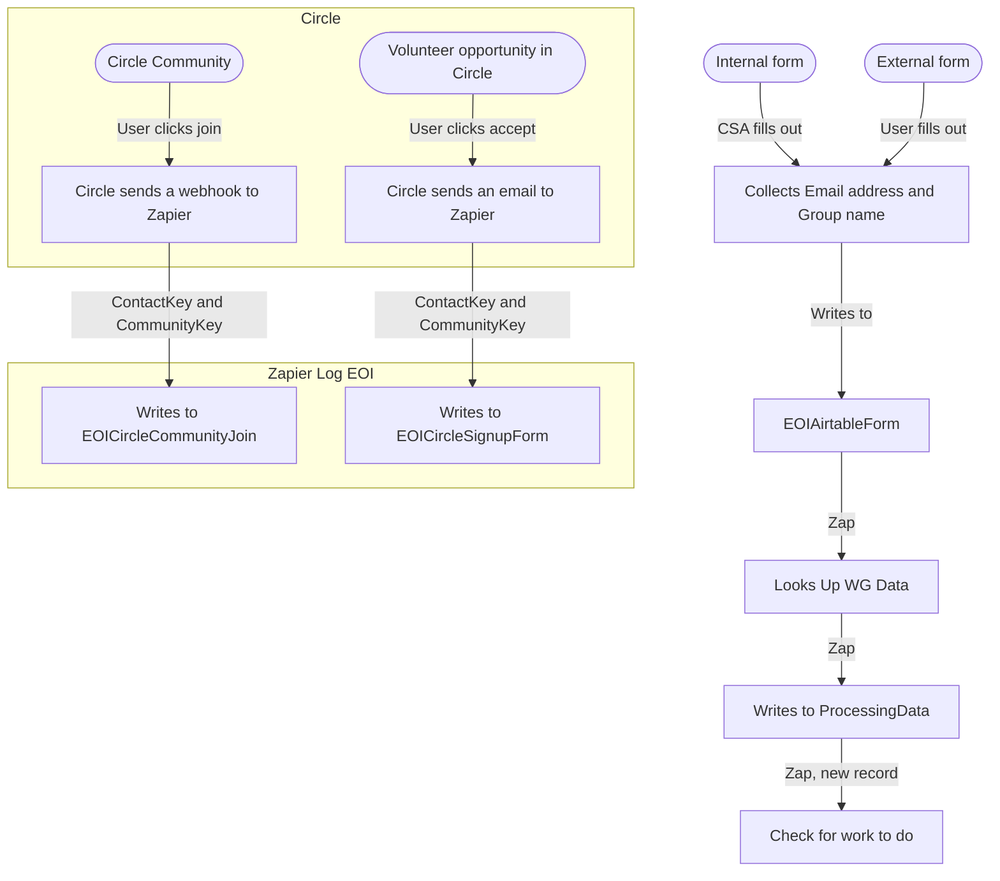

```mermaid
graph TD;

%% CIRCLE SIDE
subgraph Circle
joinCommunity([Circle Community])
joinVolunteer([Volunteer opportunity in Circle])

joinCommunity --> |User clicks join| CircleWebHook[Circle sends a webhook to Zapier]
joinVolunteer --> |User clicks accept| CircleSendsEmail[Circle sends an email to Zapier]
end

subgraph Zapier Log EOI
%% Log the expression of internet (EOI), nothing else so it can't fail
CircleWebHook --> |ContactKey and CommunityKey| WritesToEOICircleCommunityJoin[Writes to EOICircleCommunityJoin]
CircleSendsEmail --> |ContactKey and CommunityKey| WritesToEOICircleSignupForm[Writes to EOICircleSignupForm]
end


%% FORMS
internalForm([Internal form])
externalForm([External form])
%% requires email validation, e.g. Google forms "Collect email addresses Respondents will be required to sign in to Google"
internalForm --> |CSA fills out| collectEmailAndGroup[Collects Email address and Group name]
externalForm --> |User fills out| collectEmailAndGroup[Collects Email address and Group name]
collectEmailAndGroup --> |Writes to| EOIAirtableForm[EOIAirtableForm]
EOIAirtableForm --> |Zap| LookupWGData[Looks Up WG Data]
LookupWGData --> |Zap| ProcessingData[Writes to ProcessingData]
ProcessingData  --> |Zap, new record| CheckForWorkToDo[Check for work to do]


```
