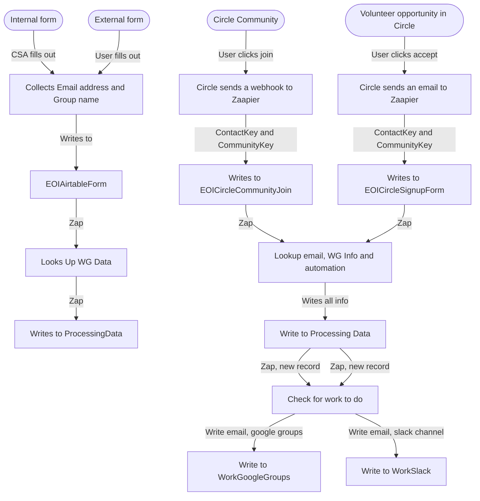

```mermaid
graph TD;


internalForm([Internal form])

externalForm([External form])
%% requires email validation, e.g. Google forms "Collect email addresses Respondents will be required to sign in to Google"

joinCommunity([Circle Community])
joinVolunteer([Volunteer opportunity in Circle])

internalForm --> |CSA fills out| collectEmailAndGroup[Collects Email address and Group name]
externalForm --> |User fills out| collectEmailAndGroup[Collects Email address and Group name]
collectEmailAndGroup --> |Writes to| EOIAirtableForm[EOIAirtableForm]
EOIAirtableForm --> |Zap| LookupWGData[Looks Up WG Data]
LookupWGData --> |Zap| WritesToProcessingData[Writes to ProcessingData]
ProcessingData  --> |Zap, new record| CheckForWorkToDo[Check for work to do]

joinCommunity --> |User clicks join| CircleWebHook[Circle sends a webhook to Zaapier]
joinVolunteer --> |User clicks accept| CircleSendsEmail[Circle sends an email to Zaapier]

CircleWebHook --> |ContactKey and CommunityKey| WritesToEOICircleCommunityJoin[Writes to EOICircleCommunityJoin]
CircleSendsEmail --> |ContactKey and CommunityKey| WritesToEOICircleSignupForm[Writes to EOICircleSignupForm]

WritesToEOICircleCommunityJoin --> |Zap| LookupWGInfoAndAutomation[Lookup email, WG Info and automation]
WritesToEOICircleSignupForm --> |Zap| LookupWGInfoAndAutomation[Lookup email, WG Info and automation]

LookupWGInfoAndAutomation --> |Wites all info| ProcessingData[Write to Processing Data]

ProcessingData --> |Zap, new record| CheckForWorkToDo[Check for work to do]

CheckForWorkToDo --> |Write email, google groups| WriteToWorkGoogleGroups[Write to WorkGoogleGroups]
CheckForWorkToDo --> |Write email, slack channel| WriteToWorkSlack[Write to WorkSlack]
```
