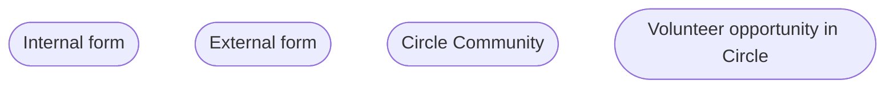

```mermaid
graph TD;


internalForm([Internal form])

externalForm([External form])
%% requires email validation, e.g. Google forms "Collect email addresses Respondents will be required to sign in to Google"

joinCommunity([Circle Community])
joinVolunteer([Volunteer opportunity in Circle])

 

 

```
