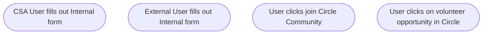

```mermaid
graph TD;

internalForm([CSA User fills out Internal form])

externalForm([External User fills out Internal form])
%% requires email validation, e.g. Google forms "Collect email addresses Respondents will be required to sign in to Google"

joinCommunity([User clicks join Circle Community])
joinVolunteer([User clicks on volunteer opportunity in Circle])


```
