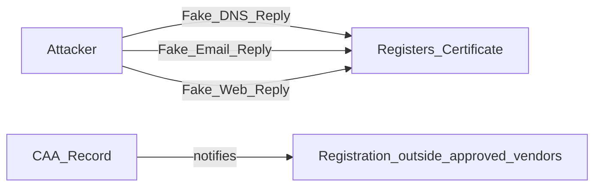

# Threats to TLS certificates

```mermaid
graph LR
Attacker -->|Fake_DNS_Reply|Registers_Certificate
Attacker -->|Fake_Email_Reply|Registers_Certificate
Attacker -->|Fake_Web_Reply|Registers_Certificate

CAA_Record -->|notifies|Registration_outside_approved_vendors
```
