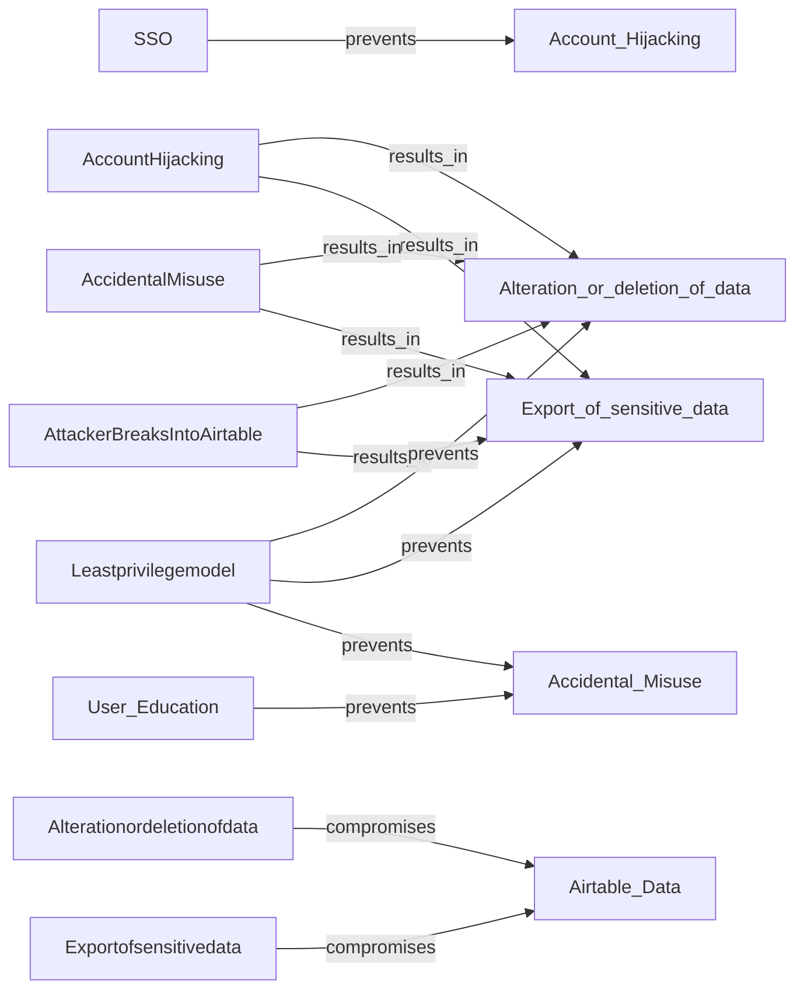

# Threat model for airtable.com

```mermaid
graph LR

SSO -->|prevents|AccountHijackingAccount_Hijacking[Account_Hijacking]
AccountHijacking -->|results_in|Alteration_or_deletion_of_data[Alteration_or_deletion_of_data]
AccountHijacking -->|results_in|Export_of_sensitive_data[Export_of_sensitive_data]

Alterationordeletionofdata -->|compromises|Airtable_Data[Airtable_Data]
Exportofsensitivedata -->|compromises|Airtable_Data[Airtable_Data]

User_Education -->|prevents|Accidental_Misuse[Accidental_Misuse]
AccidentalMisuse -->|results_in|Alteration_or_deletion_of_data[Alteration_or_deletion_of_data]
AccidentalMisuse -->|results_in|Export_of_sensitive_data[Export_of_sensitive_data]

AttackerBreaksIntoAirtable -->|results_in|Alteration_or_deletion_of_data[Alteration_or_deletion_of_data]
AttackerBreaksIntoAirtable -->|results_in|Export_of_sensitive_data[Export_of_sensitive_data]

Leastprivilegemodel
Leastprivilegemodel -->|prevents|Alteration_or_deletion_of_data[Alteration_or_deletion_of_data]
Leastprivilegemodel -->|prevents|Export_of_sensitive_data[Export_of_sensitive_data]
Leastprivilegemodel -->|prevents|Accidental_Misuse[Accidental_Misuse]

```
