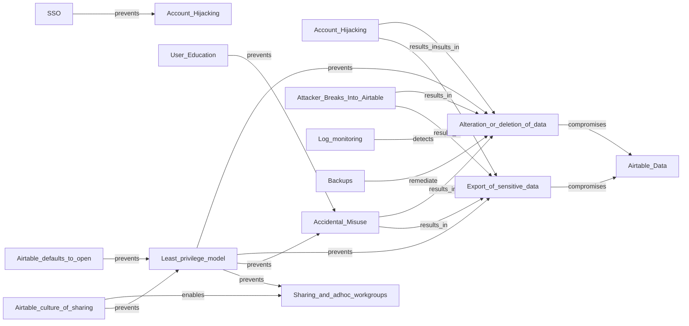

# Threat model for airtable.com

Original map as PNG (from Miro)

# What we've learned from the threat model

## We can secure our accounts by using SSO

Using SSO with Google largely addresses any account hijacking issues.

## We can recover data as we have backups

We have a daily backup of all our airtable data

## We can detect alterations/deletions via logs

But this would require a massive amount of time, or buying some technology and tuning it, seeing as how we have logs and backups we can retroactively handle this. The log process is: request a day of logs, Airtable processes it and sends an email with a link to a CSV file, the CSV file contains links to the log files which are JSON blobs stored in S3 (AWS keyed access so reasonably secure). I have asked support@ how long those logs are kept there.

## User education

User education is tricky as the airtable interface makes doing least privilege tricky, it defaults to generally permissive permissions.

## Airtable can be made secure but this will impact functionality

Airtable is designed to support and enable adhoc work/groups/mashups with access to data across groups. In general the product has made choices that prize collaboration and adhoc data sharing over security. You can lock it down with a least privilege model but this will heavily impact the usability.

