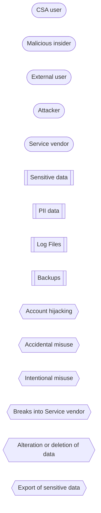

# Template

```mermaid
flowchart LR

%% Actors ([])
%% Assets [[]]
%% Actions {{}}

  %% Standard actors
  CSAUser([CSA user])
  MaliciousInsider([Malicious insider])
  ExternalUser([External user]) 
  Attacker([Attacker])
  ServiceVendor([Service vendor])
  
  %% Standard assets
  SensitiveData[[Sensitive data]]
  PIIData[[PII data]]
  LogFiles[[Log Files]]
  Backups[[Backups]]
  
  %% Standard actions
  AccountHijacking{{Account hijacking}}
  AccidentalMisuse{{Accidental misuse}}
  IntentionalMisuse{{Intentional misuse}}
  BreaksintoServiceVendor{{Breaks into Service vendor}}
  AlterationDeletionofData{{Alteration or deletion of data}}
  ExportofsensitiveData{{Export of sensitive data}}
  
```
